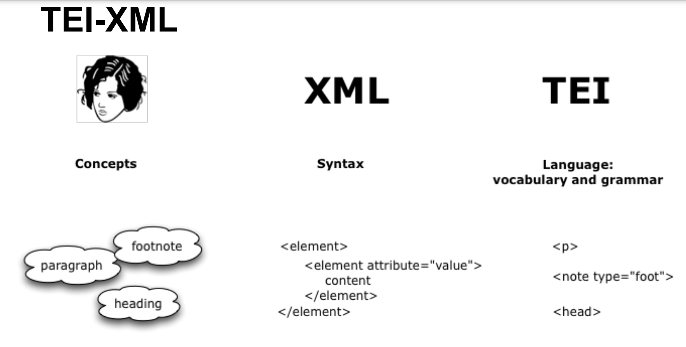

# What does TEI look like?

So what does an XML document encoded using TEI guidelines look like? Let's refer back to this visual that explains the difference between XML and TEI:

Again, XML provides the syntax, which we're starting to pick up on: how elements are used, how tags are structured, and so on. The TEI guidelines offer a set of rules that express certain types of ideas, using XML syntax: in other words, it provides vocabulary and guidelines for the highly flexible XML. For instance, TEI says that `
` is what you should use to denote a paragraph in your text. 

Make this a child page of structure
