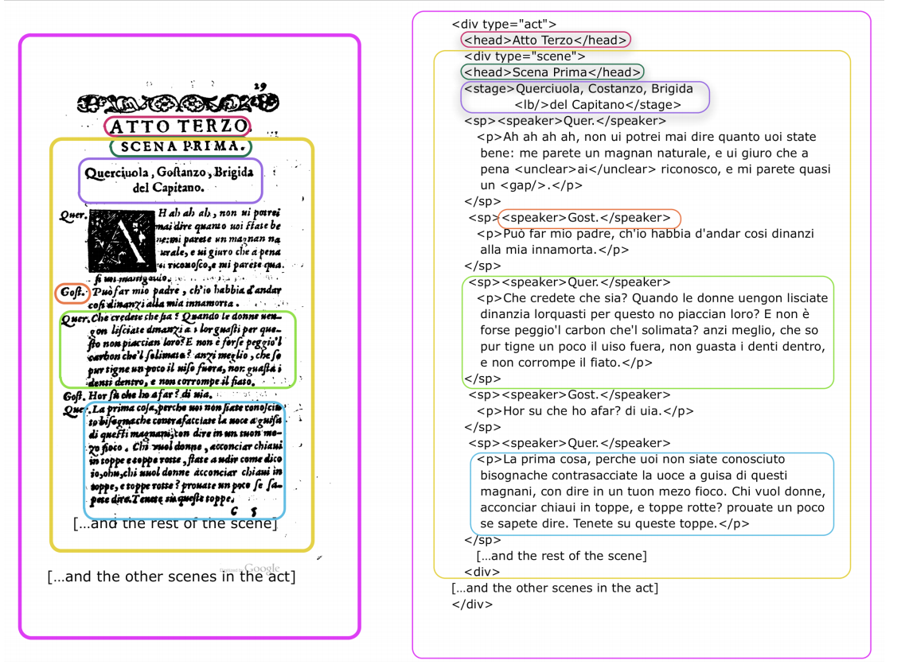

# What does XML look like? How is it constructed?

Understanding the anatomy of XML is crucial to working with the TEI guidelines. Let's look at some basic features: **elements**, **tags** (opening and closing), and **attributes**. We also have a handy Jargon Busting (needs link) section at the end should you wish to refer to them. 

**Element** - as building blocks of XML, elements are kind of like containers that provide structure to the human readable content, for example `<paragraph>`, `<name>`, and `<subject>` are elements.  
**Tag** - tags denote elements in a machine readable format. They signal elements to computing applications. They are usually enclosed in angle brackets, for example `

` for ‘paragraph’. Tags almost always appear in pairs (opening and closing).  
**Attribute** - include additional information to enrich the element. In this example, additional info is provided about the type of location.  

We will look at how to structure these in the sections below.

## XML Validity

In an XML file (which includes your XML file encoded using TEI guidelines), there are a few elements you need to have to ensure the document is **well-formed** (valid according to XML rules). Take a look at this example:

First of all, each start tag in valid XML has to have a corresponding end tag. Think of the Russian Matryoshka dolls: they need a top and a bottom part in order to function. That’s how we make sure information is contained in the right place under the right tag.

For elements in an XML document that are **nested**, the inner element needs to be properly closed off first prior to closing off the outside element (similar to HTML). For example, `<tutorial><topic>XML</topic></tutorial>` is valid but `<tutorial><topic>XML</tutorial></topic>` is not. In this example, the `<speaker>` element is nested within the `<sp>` element. `<speaker>` is opened **and** closed before the `<sp>` element can be closed.

XML documents need to have a root element, which is the parent of all the other elements. With TEI XML, this element is generally `<TEI>`. 

There are a couple of other rules as well, but these are the main ones. When it comes to the actual work of encoding your text, the editor you're using to mark up your text will often have a feature to help check if your document is valid. A tool like Oxygen will also help identify the problem by providing some additional information. Depending on the tool, you might also have the option to select a **template** that will have many necessary elements in place for you. 

In summary, here are a couple of basic XML rules:
* Start tags must have corresponding end tags
* Must have a root element
* Nested elements must be nested properly

### Questions

* Looking at the image, can you identify another set of opening and closing tags?
* Can you identify another example of an element nested within another element?
